# Device Management Service

A RESTful API for managing devices, built with .NET 10 following Clean Architecture principles and the CQRS (Command Query Responsibility Segregation) pattern.

## Table of Contents

- [Getting Started](#getting-started)
- [API Endpoints](#api-endpoints)
- [Architecture](#architecture)
- [Important Notes & Caveats](#important-notes--caveats)
- [Future Improvements](#future-improvements)

---

## Getting Started

### Prerequisites

- [Docker](https://www.docker.com/get-started) and Docker Compose
- .NET 10 SDK (for local development only)

### Running with Docker (Recommended)

The easiest way to run the application is using Docker Compose, which will spin up both the API and SQL Server database:

```bash
# Clone the repository and navigate to the project folder

# Build and start the containers
docker-compose up --build
```

Once running, the API will be available at:
- **Swagger UI**: http://localhost:8080/swagger

To stop the application:
```bash
docker-compose down

# To also remove the database volume (fresh start):
docker-compose down -v
```

### Running Locally

If you prefer to run without Docker:

1. Make sure you have SQL Server running locally
2. Update the connection string in `appsettings.Development.json`
3. Run the following commands:

```bash
cd DeviceManagementService.Api
dotnet run
```

---

## API Endpoints

| Method | Endpoint | Description |
|--------|----------|-------------|
| `GET` | `/api/devices` | Get all devices (with optional filters) |
| `GET` | `/api/devices/{id}` | Get a device by ID |
| `POST` | `/api/devices` | Create a new device |
| `PUT` | `/api/devices` | Replace an existing device |
| `PATCH` | `/api/devices` | Partially update a device |
| `DELETE` | `/api/devices/{id}` | Delete a device |

### Query Parameters for GET /api/devices

| Parameter | Type | Description |
|-----------|------|-------------|
| `name` | string | Filter by device name (optional) |
| `brand` | string | Filter by brand (optional) |
| `state` | enum | Filter by state: `Available`, `InUse`, `Inactive` (optional) |
| `page` | int | Page number, default: 1 |
| `pageSize` | int | Items per page, default: 10, max: 100 |

### Device States

Devices can be in one of three states:

| State | Description |
|-------|-------------|
| `Available` | Device is available for use |
| `InUse` | Device is currently being used |
| `Inactive` | Device is inactive/decommissioned |

### Example Requests

**Create a device:**
```bash
curl -X POST http://localhost:8080/api/devices \
  -H "Content-Type: application/json" \
  -d '{"name": "MacBook Pro", "brand": "Apple"}'
```

**Get all available devices:**
```bash
curl "http://localhost:8080/api/devices?state=Available&page=1&pageSize=10"
```

---

## Architecture

This project follows **Clean Architecture** with clear separation of concerns across four layers:

```
┌─────────────────────────────────────────────────────────────────┐
│                        API Layer                                │
│   Controllers, Middleware, Program.cs                           │
├─────────────────────────────────────────────────────────────────┤
│                    Application Layer                            │
│   Commands, Queries, Handlers, Validators, DTOs, Behaviors      │
├─────────────────────────────────────────────────────────────────┤
│                   Infrastructure Layer                          │
│   Repositories, DbContext, Migrations                           │
├─────────────────────────────────────────────────────────────────┤
│                      Domain Layer                               │
│   Entities, Enums, Exceptions                                   │
└─────────────────────────────────────────────────────────────────┘
```

### Class Diagram

```mermaid
classDiagram
    direction TB

    %% Domain Layer
    class Device {
        +int Id
        +string Name
        +string Brand
        +DeviceState State
        +DateTime CreatedAt
        +UpdateDevice(name, brand, state)
        +CanBeModified() bool
    }

    class DeviceState {
        <<enumeration>>
        Available
        InUse
        Inactive
    }

    class NotFoundException {
        +NotFoundException(entityName, key)
    }

    class BusinessRuleException {
        +BusinessRuleException(message)
    }

    %% Infrastructure Layer
    class IDeviceRepository {
        <<interface>>
        +GetByIdAsync(id) Device
        +GetByFilterAsync(filters) IEnumerable~Device~
        +AddAsync(device)
        +UpdateAsync(device)
        +DeleteAsync(device)
    }

    class DeviceRepository {
        -ApplicationDbContext _context
        +GetByIdAsync(id) Device
        +GetByFilterAsync(filters) IEnumerable~Device~
        +AddAsync(device)
        +UpdateAsync(device)
        +DeleteAsync(device)
    }

    class ApplicationDbContext {
        +DbSet~Device~ Devices
        #OnModelCreating(modelBuilder)
    }

    %% Application Layer - Commands
    class CreateDeviceCommand {
        +string Name
        +string Brand
        +DeviceState? State
    }

    class UpdateDeviceCommand {
        +int Id
        +string? Name
        +string? Brand
        +DeviceState? State
    }

    class ReplaceDeviceCommand {
        +int Id
        +string Name
        +string Brand
        +DeviceState State
    }

    class DeleteDeviceCommand {
        +int Id
    }

    %% Application Layer - Queries
    class GetDeviceByIdQuery {
        +int Id
    }

    class GetDevicesByFilterQuery {
        +string? Name
        +string? Brand
        +DeviceState? State
        +int Page
        +int PageSize
    }

    %% Application Layer - Handlers
    class CreateDeviceCommandHandler {
        -IDeviceRepository _repository
        +Handle(command) int
    }

    class UpdateDeviceCommandHandler {
        -IDeviceRepository _repository
        +Handle(command) Unit
    }

    class GetDeviceByIdQueryHandler {
        -IDeviceRepository _repository
        +Handle(query) DeviceDTO
    }

    %% Application Layer - Validators
    class CreateDeviceCommandValidator {
        +CreateDeviceCommandValidator(options)
    }

    class ValidationBehavior~TRequest,TResponse~ {
        -IEnumerable~IValidator~ _validators
        +Handle(request, next) TResponse
    }

    %% API Layer
    class DevicesController {
        -IMediator _mediator
        +GetDeviceById(id) IActionResult
        +GetDevicesByFilter(filters) IActionResult
        +CreateDevice(command) IActionResult
        +ReplaceDevice(command) IActionResult
        +UpdateDevice(command) IActionResult
        +DeleteDevice(id) IActionResult
    }

    class GlobalExceptionHandlerMiddleware {
        -RequestDelegate _next
        -ILogger _logger
        +InvokeAsync(context)
    }

    %% Relationships
    Device --> DeviceState
    DeviceRepository ..|> IDeviceRepository
    DeviceRepository --> ApplicationDbContext
    ApplicationDbContext --> Device

    CreateDeviceCommandHandler --> IDeviceRepository
    UpdateDeviceCommandHandler --> IDeviceRepository
    GetDeviceByIdQueryHandler --> IDeviceRepository

    CreateDeviceCommandHandler ..> CreateDeviceCommand
    UpdateDeviceCommandHandler ..> UpdateDeviceCommand
    GetDeviceByIdQueryHandler ..> GetDeviceByIdQuery

    CreateDeviceCommandValidator ..> CreateDeviceCommand
    ValidationBehavior --> CreateDeviceCommandValidator

    DevicesController --> CreateDeviceCommand
    DevicesController --> UpdateDeviceCommand
    DevicesController --> GetDeviceByIdQuery
    DevicesController --> GetDevicesByFilterQuery

    CreateDeviceCommandHandler ..> NotFoundException
    UpdateDeviceCommandHandler ..> NotFoundException
    GlobalExceptionHandlerMiddleware ..> NotFoundException
    GlobalExceptionHandlerMiddleware ..> BusinessRuleException
```



### Key Design Patterns

- **CQRS**: Commands (write operations) and Queries (read operations) are separated
- **MediatR**: Handles dispatching commands/queries to their handlers
- **Repository Pattern**: Abstracts data access logic
- **Validation Pipeline**: FluentValidation with MediatR pipeline behavior

---

## Important Notes & Caveats

### 1. Default Device State

When creating a new device, if the `state` field is not provided, it defaults to `Available`.

```json
// This request...
{
  "name": "iPhone 15",
  "brand": "Apple"
}

// ...creates a device with state = Available
{
  "id": 1,
  "name": "iPhone 15",
  "brand": "Apple",
  "state": "Available",
  "createdAt": "2024-01-01T00:00:00Z"
}
```

### 2. Devices In Use Cannot Be Modified

Devices with state `InUse` cannot be modified or deleted. You must first change their state before making changes.

### 3. Seed Data

The database is pre-seeded with 5 sample devices for testing purposes. To start fresh, run:

```bash
docker-compose down -v
docker-compose up --build
```

---

## Future Improvements

### Validator Refactoring

The current validators have repetitive validation rules for common fields like `Name`, `Brand`, and `State`. A planned improvement is to:

1. **Create a base validator class** with common validation rules
2. **Inherit from the base class** in specific validators
3. **Reduce code duplication** and improve maintainability

```csharp
// Planned structure:
public abstract class DeviceValidatorBase<T> : AbstractValidator<T>
{
    protected void AddNameRules(Expression<Func<T, string>> selector) { ... }
    protected void AddBrandRules(Expression<Func<T, string>> selector) { ... }
    protected void AddStateRules(Expression<Func<T, DeviceState?>> selector) { ... }
}

public class CreateDeviceCommandValidator : DeviceValidatorBase<CreateDeviceCommand>
{
    public CreateDeviceCommandValidator(IOptions<DeviceValidationOptions> options)
    {
        AddNameRules(x => x.Name);
        AddBrandRules(x => x.Brand);
        AddStateRules(x => x.State);
    }
}
```

### Other Potential Improvements

- Add authentication and authorization
- Implement soft delete for devices
- Add audit logging for device changes
- Implement rate limiting
- Add health checks endpoint
- Create a parent class for commands and validators to inherit common validator class to apply repetitive rules for name, brand, state etc. This will reduce redundancy and improve maintainability.

---

## Tech Stack

| Technology | Purpose |
|------------|---------|
| .NET 10 | Runtime & Framework |
| Entity Framework Core 10 | ORM & Data Access |
| SQL Server 2022 | Database |
| MediatR | CQRS & Mediator Pattern |
| FluentValidation | Request Validation |
| Docker | Containerization |
| Swagger/OpenAPI | API Documentation |

---

## License

This project is for educational/interview purposes.
